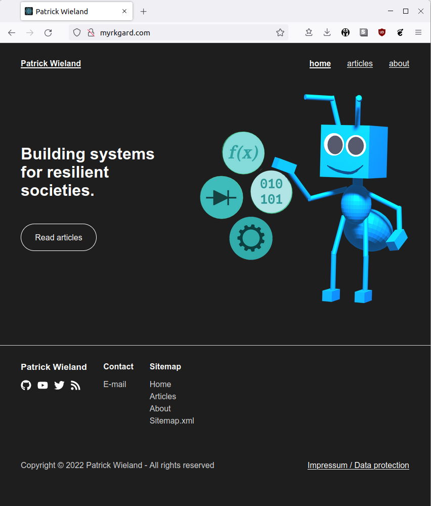

# Personal Website

Simple personal website to be hosted on a single virtual server.

Consists of containers:

- Reverse proxy (pwreverseproxy)
- Website (pwwebsite)
- Dashboard (pwdashboard)
- API server (pwapi)
- Database (pwmongodb)

